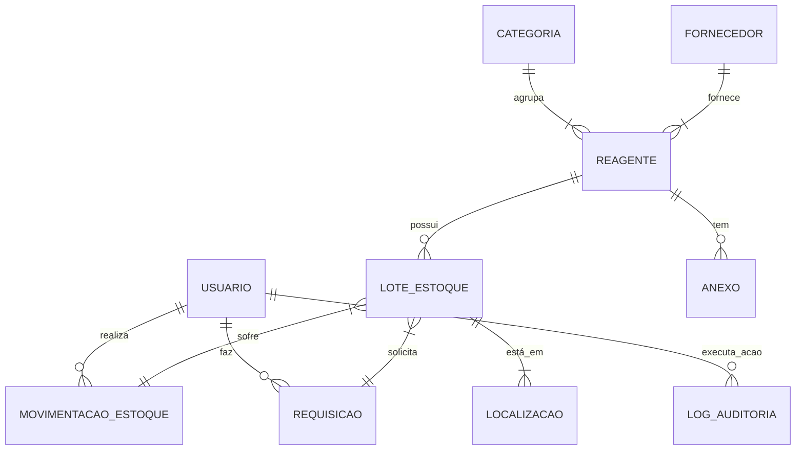

# Modelo de Dados: Sistema de Controle de Estoque

Este documento detalha as entidades de dados, seus atributos e relacionamentos, com base na especificação da funcionalidade.

## Diagrama de Entidade-Relacionamento (Conceitual)

## Detalhamento das Entidades

### 1. Usuario
- **Tabela**: `users_user`
- **Descrição**: Armazena os usuários do sistema.
- **Campos**:
    - `id` (PK, BigAutoField): Identificador único.
    - `username` (CharField, 150, unique): Nome de usuário para login.
    - `email` (EmailField, unique): Email do usuário.
    - `password` (CharField): Hash da senha.
    - `first_name` (CharField, 150): Primeiro nome.
    - `last_name` (CharField, 150): Sobrenome.
    - `role` (CharField, 20, choices=['Analista', 'Convidado']): Papel do usuário no sistema.
    - `is_active` (BooleanField, default=True): Status do usuário.
    - `date_joined` (DateTimeField, auto_now_add=True): Data de criação.

### 2. Categoria
- **Tabela**: `inventory_category`
- **Descrição**: Linha de produtos (ex: "Químicos", "Reagentes Químicos para Análise").
- **Campos**:
    - `id` (PK, BigAutoField): Identificador único.
    - `name` (CharField, 100, unique): Nome da categoria.
    - `description` (TextField, nullable): Descrição opcional.

### 3. Fornecedor
- **Tabela**: `inventory_supplier`
- **Descrição**: Fornecedor dos reagentes.
- **Campos**:
    - `id` (PK, BigAutoField): Identificador único.
    - `name` (CharField, 200): Nome do fornecedor.
    - `contact_person` (CharField, 200, nullable): Pessoa de contato.
    - `email` (EmailField, nullable): Email de contato.
    - `phone` (CharField, 50, nullable): Telefone de contato.

### 4. Localizacao
- **Tabela**: `inventory_location`
- **Descrição**: Localização física de um lote no laboratório.
- **Campos**:
    - `id` (PK, BigAutoField): Identificador único.
    - `name` (CharField, 100, unique): Nome da localização (ex: "Prateleira A-3").
    - `description` (TextField, nullable): Descrição adicional (ex: "Armário de inflamáveis").

### 5. Reagente
- **Tabela**: `inventory_reagent`
- **Descrição**: Representa um tipo de produto químico ou reagente.
- **Campos**:
    - `id` (PK, BigAutoField): Identificador único.
    - `name` (CharField, 255): Nome do reagente.
    - `sku` (CharField, 100, unique): Código único do produto (SKU).
    - `category` (FK -> Categoria): Categoria do reagente.
    - `supplier` (FK -> Fornecedor): Fornecedor principal.
    - `storage_conditions` (CharField, 255): Condições de armazenamento (ex: "2-8°C", "Temperatura ambiente").
    - `min_stock_level` (DecimalField): Nível mínimo de estoque para alertas.
    - `current_value` (DecimalField, nullable): Valor de mercado atual (opcional).

### 6. LoteDeEstoque
- **Tabela**: `inventory_stocklot`
- **Descrição**: Um lote específico de um reagente em estoque.
- **Campos**:
    - `id` (PK, BigAutoField): Identificador único.
    - `reagent` (FK -> Reagente): Reagente ao qual o lote pertence.
    - `lot_number` (CharField, 100): Número do lote fornecido pelo fabricante.
    - `location` (FK -> Localizacao): Onde o lote está armazenado.
    - `expiry_date` (DateField): Data de validade do lote.
    - `purchase_price` (DecimalField): Custo de compra do lote.
    - `initial_quantity` (DecimalField): Quantidade original na entrada.
    - `current_quantity` (DecimalField): Quantidade atualmente em estoque.
    - `entry_date` (DateTimeField, auto_now_add=True): Data de registro no sistema.

### 7. MovimentacaoDeEstoque
- **Tabela**: `inventory_stockmovement`
- **Descrição**: Registra toda entrada, saída ou ajuste de um lote.
- **Campos**:
    - `id` (PK, BigAutoField): Identificador único.
    - `stock_lot` (FK -> LoteDeEstoque): Lote que foi movimentado.
    - `user` (FK -> Usuario): Usuário que realizou a movimentação.
    - `quantity` (DecimalField): Quantidade movimentada (pode ser negativa para saídas).
    - `move_type` (CharField, choices=['Entrada', 'Retirada', 'Ajuste', 'Descarte']): Tipo de movimentação.
    - `timestamp` (DateTimeField, auto_now_add=True): Data e hora da movimentação.
    - `notes` (TextField, nullable): Observações sobre a movimentação.

### 8. Anexo
- **Tabela**: `inventory_attachment`
- **Descrição**: Um arquivo anexado a um reagente (FISPQ, CoA).
- **Campos**:
    - `id` (PK, BigAutoField): Identificador único.
    - `reagent` (FK -> Reagente): Reagente ao qual o anexo pertence.
    - `file` (FileField): O arquivo PDF/documento.
    - `description` (CharField, 255): Descrição do anexo (ex: "FISPQ em Português").
    - `upload_date` (DateTimeField, auto_now_add=True): Data do upload.

### 9. LogDeAuditoria
- **Tabela**: `auditing_log`
- **Descrição**: Log imutável de todas as ações importantes.
- **Campos**:
    - `id` (PK, BigAutoField): Identificador único.
    - `user` (FK -> Usuario, nullable): Usuário que executou a ação.
    - `action` (CharField, 255): Descrição da ação (ex: "CREATE_REAGENT", "UPDATE_STOCKLOT_QUANTITY").
    - `timestamp` (DateTimeField, auto_now_add=True): Data e hora da ação.
    - `details` (JSONField): Detalhes da ação, como os dados antigos e novos.

### 10. Requisicao
- **Tabela**: `inventory_requisition`
- **Descrição**: Um pedido de material feito por um usuário.
- **Campos**:
    - `id` (PK, BigAutoField): Identificador único.
    - `requester` (FK -> Usuario): Usuário que solicitou o material.
    - `reagent` (FK -> Reagente): Reagente solicitado.
    - `quantity` (DecimalField): Quantidade solicitada.
    - `status` (CharField, choices=['Pendente', 'Aprovada', 'Rejeitada']): Status do pedido.
    - `approver` (FK -> Usuario, nullable): Usuário que aprovou/rejeitou.
    - `request_date` (DateTimeField, auto_now_add=True): Data da solicitação.
    - `approval_date` (DateTimeField, nullable): Data da aprovação/rejeição.
